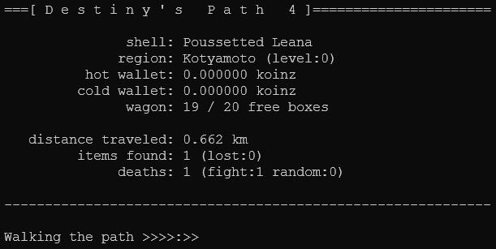

# Destiny's Path 4

Destiny's Path 4 is an idle-game that is *played* in the terminal. No user input is necessary when it runs. Everything that happens depends on your luck.

It was created just for fun/learning. Like part 1-3, which I never made public ;-)

[Demo video on YouTube](https://www.youtube.com/watch?v=VyzdqNGaVuI)

- [Dependecies](#dependecies)
- [Installation](#installation)
- [Updating](#updating)
- [Quickstart](#quickstart)
- [Options](#options)
- [Examples](#examples)
- [Screenshot + Display Text Glossary](#display-text-glossary)
- [Thanks](#thanks)
- [License](#license)

---

## Dependecies

- [Python](https://www.python.org/downloads/) version `>= 3.9.2`
- A terminal to run it. The default on any platform should do the trick - e.g. xterm, terminator, powershell, cmd, etc.

**Note**: DP4 was written and tested on Python  `3.9.2`. **Later Python versions could introduce breaking changes**, but usually you're good with installing the latest one. You can have multiple Python versions installed at the same time. If you're not sure which version you have installed, try `python3 --version` in the terminal.

---

## Installation

1. Install [Python](https://www.python.org/downloads/) `>= 3.9.2`.
On *nix: It's most probably already installed. Otherwise install **python3** with your favorite package manager.  
On Windows/Other: Download the version for your operating system and install it. Make sure to let the setup program *"add Python to your PATH"*.  
2. [Download](https://github.com/etrusci-org/destinyspath4/releases) the latest DP4 release.
3. Unpack the compressed release file and copy the **destinyspath4-x.x.x** directory to any place on your system.

---

## Updating

To update, just repeat the [Installation](#installation) steps and copy over your previous save files.

If an update requires a save data reset, the game will do that automatically on the next start. A backup of your old save data files will be created inside the save data directory.

---

## Quickstart

Open a terminal window and change into the `game/` directory:

```bash
cd path/to/destinyspath4/game/
```

Play the game:

```bash
# on *nix systems
./dp4.py --play # maybe you have to make dp4.py executable first with `chmod +x dp4.py`
```

```bash
# on Windows systems:
python3 dp4.py --play
# or if `python3` does not work try...
python3.exe dp4.py --play
# or
C:/path/to/python3/python3.exe dp4.py --play
```

Progress will be auto-saved from time to time or when you quit the game by pressing `CTRL`+`C`.

---

## Options

All arguments are optional. If you provide none, the quickhelp will be displayed. You can use either the short or long version of the argument. E.g. `--play` and `-p` are the same.

`-h`, `--help`  
Display the quickhelp.

`-p`, `--play`  
Play the game.

`-s`, `--list-saves`  
List save data info from the current save data directory.

`-n <NAME>`, `--save-name <NAME>`  
Name of the save game to create or resume from. Default=`game1`

`-d <PATH>`, `--save-dir <PATH>`  
Path to the save data directory. Default=`/path/to/destinyspath4/game/save`

`-i <SECONDS>`, `--autosave-interval <SECONDS>`  
Time in seconds on which the progress should automatically be saved to file. Default=`300`

`-f`, `--log-to-file`  
Write progress lines to a log file. It will be stored inside the save data directory.

---

## Examples

**Display the quick help**:

```bash
dp4.py
dp4.py --help
dp4.py -h
```

**Play the game** - Starts or resumes a game using the default save data file name and directory:

```bash
dp4.py --play
dp4.py -p
```

**List save data info from the current save data directory**:

```bash
dp4.py --list-saves
dp4.py -s
```

**Start or resume a game with another name** - The save data file will be named **myothergame**:

```bash
dp4.py --play --save-name myothergame
dp4.py -p -n myothergame
```

**Use another save data file directory** - The save data files will be stored in **/path/to/mysavedata**:

```bash
dp4.py --play --save-dir /path/to/mysavedata
dp4.py -p -d /path/to/mysavedata
```

**Change the auto-save interval**:

```bash
dp4.py --play --autosave-interval 180
dp4.py -p -i 180
```

**Write progress lines to log file**:

```bash
dp4.py --play --log-to-file
dp4.py -p -f
```

**Arguments can be combined**:

```bash
dp4.py --play --save-name myothergame --save-dir /path/to/mysavedata --autosave-interval 180 --log-to-file
dp4.py -p -n myothergame -d /path/to/mysavedata -i 180 -f
```

```bash
dp4.py --list-saves --save-dir /path/to/mysavedata
dp4.py -s -d /path/to/mysavedata
```

---

## Display Text Glossary



- `shell`: Player name. Changes on each rebirth.
- `region`: Name and level number of the region the player is exploring. Changes at certain amounts of traveled distance.
- `hot wallet`: Currency amount in the hot wallet. The hot wallet can be hacked.
- `cold wallet`: Currency amount in the cold wallet. The cold wallet is secure.
- `wagon`: Free inventory boxes to store items in.
- `distance traveled`: Total distance the player has traveled.
- `items found`: Total items found and total items stolen by foes.
- `items sold`: Total items sold.
- `income`: Total income from selling items and the amount stolen by hackers.
- `kills`: Total killed foes.
- `deaths`: Total times the player has died and breakdown where it happened.
- `<iNumber>`: Current game loop iteration streak. Resets on each game restart.

---

## Thanks

Some asset text data was contributed by [orochihanma](https://twitch.tv/orochihanma) and [execratus](https://twitch.tv/exe_cratus) in:
- [object_name.dat](./game/asset/object_name.dat)
- [object_prefix.dat](./game/asset/object_prefix.dat)
- [object_suffix.dat](./game/asset/object_suffix.dat)

---

## License

Public Domain
