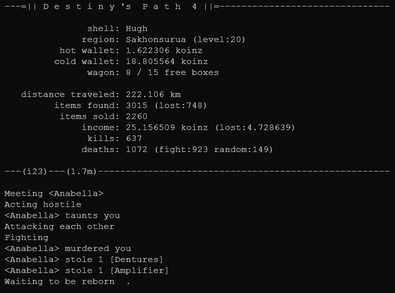

# Destiny's Path 4

Destiny's Path is an idle-game that is *played* in the terminal. No user input is necessary when it runs. Everything that happens depends on your luck.

It was created just for fun/learning. Like part 1-3, which I never made public ;-)



---

## Dependecies

- [Python](https://www.python.org/downloads/) version `>= 3.9.2`
- A terminal to run it. The default on any platform should do the trick - e.g. xterm, terminator, powershell, cmd, etc.

**Note**: DP4 was written and tested on Python  `3.9.2`. **Later Python versions could introduce breaking changes**, but usually you're good with installing the latest one. You can have multiple Python versions installed at the same time. If you're not sure which version you have installed, try `python3 --version` in the terminal.

---

## Installation

1. Install [Python](https://www.python.org/downloads/) `>= 3.9.2`.
On *nix: It's most probably already installed. Otherwise install **python3** with your favorite package manager.  
On Windows/Other: Download the version for your operating system and install it. Make sure to let the setup program *"add Python to your PATH"*.  
2. [Download](https://github.com/etrusci-org/destinyspath4/releases) the latest DP4 release.
3. Unpack the compressed release file and copy the **destinyspath4-x.x.x** directory to any place on your system.

To update, just repeat those steps and copy over the previous save files.

---

## Quickstart

Open a terminal window and change into the `game/` directory:

```bash
cd path/to/destinyspath4/game/
```

Play the game:

```bash
# on *nix systems
./dp4.py --play # maybe you have to make dp4.py executable first with `chmod +x dp4.py`
```

```bash
# on Windows systems:
python3 dp4.py --play
# or if `python3` does not work try...
python3.exe dp4.py --play
# or
C:/path/to/python3/python3.exe dp4.py --play
```

Progress will be auto-saved from time to time or when you quit the game by pressing `CTRL`+`C`.

---

## Options

All arguments are optional. If you provide none, the quickhelp will be displayed.

`-h`, `--help`  
Display the quickhelp.

`-p`, `--play`  
Play the game.

`-s`, `--list-saves`  
List save data info from the current save data directory.

`-n <NAME>`, `--save-name <NAME>`  
Name of the save game to create or resume from. Default=`game1`

`-d <PATH>`, `--save-dir <PATH>`  
Path to the save data directory. Default=`/path/to/destinyspath4/game/save`

`-i <SECONDS>`, `--autosave-interval <SECONDS>`  
Time in seconds on which the progress should automatically be saved to file. Default=`300`

`-f`, `--log-to-file`  
Write progress lines to log file. The files will be stored inside the save data directory and are rotated daily.

---

## Examples

**Display the quick help**:

```bash
dp4.py
```

```bash
dp4.py --help
```

```bash
dp4.py -h
```

**Play the game** - Starts or resumes a game using the default save data file name and directory:

```bash
dp4.py --play
```

```bash
dp4.py -p
```

**List save data info from the current save data directory**:

```bash
dp4.py --list-saves
```

```bash
dp4.py -s
```

**Start or resume a game with another name** - The save data file will be named **myothergame**:

```bash
dp4.py --play --save-name myothergame
```

```bash
dp4.py -p -n myothergame
```

**Use another save data file directory** - The save data files will be stored in **/path/to/mysavedata**:

```bash
dp4.py --play --save-dir /path/to/mysavedata
```

```bash
dp4.py -p -d /path/to/mysavedata
```

**Change the auto-save interval**:

```bash
dp4.py --play --autosave-interval 180
```

```bash
dp4.py -p -i 180
```

**Write progress lines to log file**:

```bash
dp4.py --play --log-to-file
```

```bash
dp4.py -p -f
```

**Arguments can be combined**:

```bash
dp4.py --play --save-name myothergame --save-dir /path/to/mysavedata --autosave-interval 180 --log-to-file
```

```bash
dp4.py -p -n myothergame -d /path/to/mysavedata -i 180 -f
```

```bash
dp4.py --list-saves --save-dir /path/to/mysavedata
```

```bash
dp4.py -s -d /path/to/mysavedata
```

---

## Thanks

Some asset text data was contributed by [orochihanma](https://twitch.tv/orochihanma) and [execratus](https://twitch.tv/exe_cratus) in:
- [object_name.dat](./game/asset/object_name.dat)
- [object_prefix.dat](./game/asset/object_prefix.dat)
- [object_suffix.dat](./game/asset/object_suffix.dat)

---

## License

Public Domain
